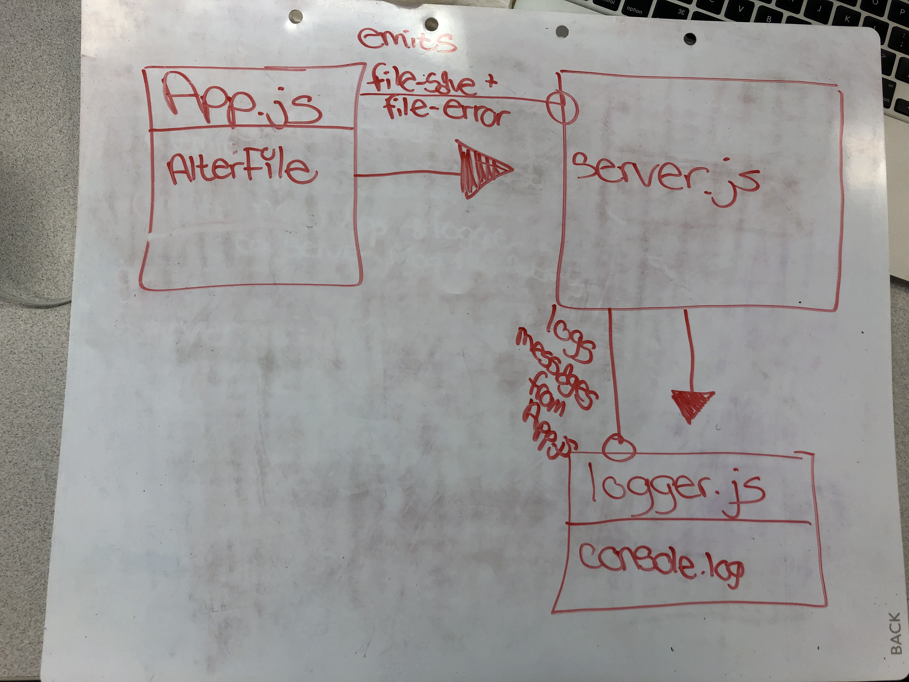

# LAB - 18

## Project Name
Socket.io

### Author: Tia Rose

### Links and Resources
* [submission PR](https://github.com/tia-rose-401-advanced-javascript/lab-18/pull/1)
* [travis](https://www.travis-ci.com/tia-rose-401-advanced-javascript/lab-18)

### Setup
#### `.env` requirements
* `PORT` - 3000

#### Running the app
  * npm run start or `node ./server/server.js`
  * npm run app or `node ./app/app.js ./files/test.txt`
  * npm run err or `node ./app/app.js ./files/error.txt`
  * npm run log or `node ./logger/logger.js`
  
#### Tests
* How do you run tests?

`npm run test`

* What assertions were made?

app-test : is readFile defined, does upper make text uppercase

logger-test have console.log and error been called

* What assertions need to be / should be made?

Make sure messages were sent

Make sure messages were consoled both saved and error

#### UML
